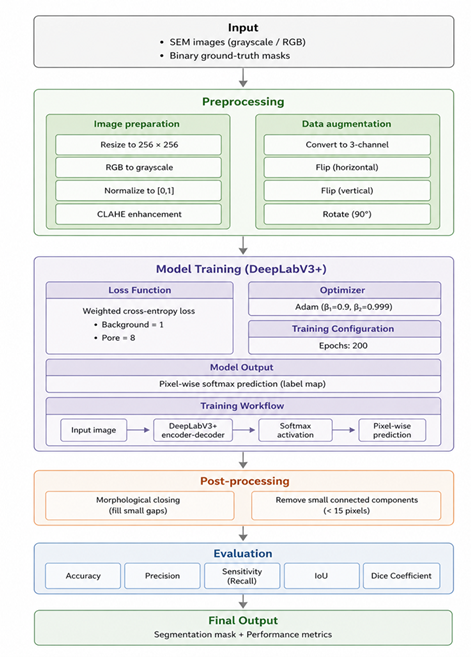
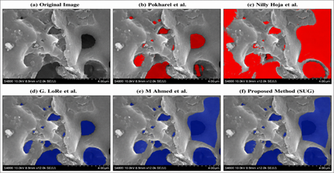
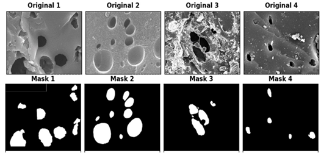
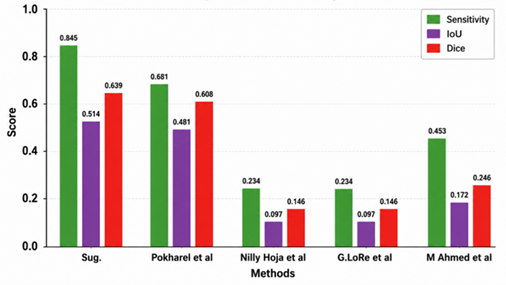

# Automated Pore Segmentation in Activated Carbon SEM Images Using a Modified DeepLabV3+-Based Deep Learning

Deep learning-based semantic segmentation framework for automated pore detection and analysis in SEM images of activated carbon using a modified DeepLabV3+ architecture.

---

# Related Manuscript

Title:

Automated Pore Segmentation in Activated Carbon SEM Images Using a Modified DeepLabV3+-Based Deep Learning

Target Journal:

Journal of Porous Materials

This repository was developed to support the reproducibility of the research manuscript submitted to the Journal of Porous Materials.

---

# Authors

- Amal Z. Badan
- Hazim G. Daway *(Corresponding Author)*
- Aseel M. Abdul Majeed

Department of Physics, College of Science, Mustansiriyah University

Corresponding Email:

hazimdo@uotechnology.edu.iq

---

# Overview

This repository presents a semantic segmentation framework for pore detection in SEM images using:

- DeepLabV3+
- ResNet18 backbone
- CLAHE enhancement
- Weighted cross-entropy loss
- Morphological post-processing

The framework was developed for activated carbon pore analysis and quantitative segmentation evaluation.

---

# Workflow

<p align="center">
  
</p>

---

# Dataset

The dataset used in this study was obtained from the following public repository:

Dataset Source:

https://github.com/bhimrazy/sem-segmentation

Reference:

Pokharel et al., 2024 — A Comparative Study of State-of-the-Art Deep Learning Models for Semantic Segmentation of Pores in SEM Images of Activated Carbon.

The original dataset contains:

- SEM images of activated carbon
- Ground-truth pore masks
- Multiple pore morphologies
- Different imaging conditions

---

# Repository Dataset Samples

This repository contains:

- 5 sample SEM images
- 5 corresponding masks

for demonstration and reproducibility purposes.

The full dataset should be downloaded from the original source repository.

---

# Dataset Structure

```text
images/
masks/
```

- `images/` contains SEM images
- `masks/` contains binary pore masks

Image and mask filenames must match.

Supported formats:

- `.tif`
- `.png`

---

# Example Dataset Samples

<p align="center">
  
</p>

---

# Network Architecture

- Architecture: DeepLabV3+
- Backbone: ResNet18
- Input Size: 256 × 256 × 3
- Classes:
  - Background
  - Pore

---

# Training Configuration

| Parameter | Value |
|---|---|
| Optimizer | Adam |
| Learning Rate | 5e-4 |
| Epochs | 200 |
| Batch Size | 8 |
| Backbone | ResNet18 |
| Loss Function | Weighted Cross-Entropy |

---

# Data Augmentation

The framework applies:

- Horizontal flipping
- Vertical flipping
- Random rotation

---

# Preprocessing

CLAHE enhancement is applied to improve local contrast and pore visibility before segmentation.

---

# Comparative Segmentation Results

<p align="center">
  
</p>

---

# Quantitative Performance Evaluation

<p align="center">
  
</p>

The proposed method achieved superior:

- Sensitivity
- IoU
- Dice coefficient

compared with several classical and deep-learning-based pore segmentation methods.

---

# Requirements

- MATLAB R2022a or later
- Deep Learning Toolbox
- Image Processing Toolbox
- Computer Vision Toolbox

---

# Run the Code

Run the following MATLAB file:

```matlab
train_deeplabv3plus
```

---

# Repository Structure

```text
SEM-Pore-Segmentation-DeepLabV3Plus/
│
├── images/
├── masks/
├── assets/
├── Results/
├── train_deeplabv3plus.m
├── README.md
├── requirements.txt
├── LICENSE
├── .gitignore
```

---

# Citation

```bibtex
@article{Badan2026SEM,
  title={Automated Pore Segmentation in Activated Carbon SEM Images Using a Modified DeepLabV3+-Based Deep Learning},
  author={Badan, Amal Z. and Daway, Hazim G. and Abdul Majeed, Aseel M.},
  year={2026}
}
```

---

# License

This project is distributed under the MIT License.
